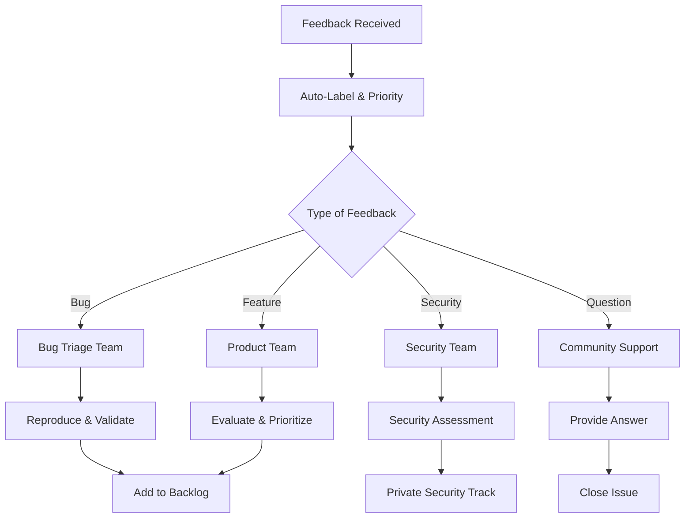

# Feedback System & Community Engagement

AI FileSystem MCP values community feedback and continuous improvement. This document outlines our feedback collection, processing, and response systems.

## 📝 Feedback Channels

### 1. GitHub Issues
**Primary channel for bug reports and feature requests**

- **Bug Reports**: [Create Bug Report](https://github.com/your-org/ai-filesystem-mcp/issues/new?template=bug_report.yml)
- **Feature Requests**: [Request Feature](https://github.com/your-org/ai-filesystem-mcp/issues/new?template=feature_request.yml)
- **Security Issues**: [Private Security Report](https://github.com/your-org/ai-filesystem-mcp/security/advisories/new)

#### Issue Templates

##### Bug Report Template
```yaml
name: Bug Report
description: Report a bug to help us improve
title: "[BUG] "
labels: ["bug", "needs-triage"]
body:
  - type: markdown
    attributes:
      value: |
        Thanks for taking the time to fill out this bug report!
  
  - type: textarea
    id: description
    attributes:
      label: Bug Description
      description: A clear and concise description of what the bug is
      placeholder: Tell us what happened
    validations:
      required: true
  
  - type: textarea
    id: reproduction
    attributes:
      label: Steps to Reproduce
      description: Steps to reproduce the behavior
      placeholder: |
        1. Execute command '...'
        2. Set parameters '...'
        3. See error
    validations:
      required: true
  
  - type: textarea
    id: expected
    attributes:
      label: Expected Behavior
      description: What you expected to happen
    validations:
      required: true
  
  - type: textarea
    id: environment
    attributes:
      label: Environment
      description: |
        - OS: [e.g. macOS 14.0]
        - Node.js: [e.g. 20.10.0]
        - MCP Version: [e.g. 2.0.0]
        - Security Level: [strict/moderate/permissive]
      placeholder: Environment details
    validations:
      required: true
```

##### Feature Request Template
```yaml
name: Feature Request
description: Suggest an idea for AI FileSystem MCP
title: "[FEATURE] "
labels: ["enhancement", "needs-review"]
body:
  - type: textarea
    id: problem
    attributes:
      label: Problem Statement
      description: What problem does this feature solve?
      placeholder: I'm frustrated when...
    validations:
      required: true
  
  - type: textarea
    id: solution
    attributes:
      label: Proposed Solution
      description: What would you like to happen?
      placeholder: I would like...
    validations:
      required: true
  
  - type: textarea
    id: alternatives
    attributes:
      label: Alternative Solutions
      description: Any alternative solutions or features considered?
  
  - type: dropdown
    id: priority
    attributes:
      label: Priority Level
      options:
        - Low - Nice to have
        - Medium - Would improve workflow
        - High - Critical for productivity
    validations:
      required: true
```

### 2. GitHub Discussions
**Community forum for questions, ideas, and general discussion**

- **Q&A**: Technical questions and troubleshooting
- **Ideas**: Brainstorming and early-stage feature discussions
- **Show and Tell**: Share your MCP use cases and projects
- **General**: General discussion about AI FileSystem MCP

### 3. User Surveys
**Periodic surveys to gather broader feedback**

#### Quarterly User Experience Survey
```markdown
# AI FileSystem MCP User Experience Survey

## Usage Patterns
1. How frequently do you use AI FileSystem MCP?
   - Daily
   - Weekly
   - Monthly
   - Occasionally

2. What are your primary use cases? (Select all that apply)
   - File management automation
   - Code analysis and refactoring
   - Git workflow automation
   - Search and discovery
   - Security scanning
   - Other: ___________

3. Which commands do you use most often? (Top 5)

## Satisfaction Ratings
Rate your satisfaction (1-5 scale):
- Overall experience: ___
- Documentation quality: ___
- Performance: ___
- Security features: ___
- Ease of use: ___

## Feedback
1. What's working well?
2. What could be improved?
3. What features are missing?
4. Any suggestions for the roadmap?
```

### 4. Performance Analytics
**Automated feedback through usage analytics**

```typescript
// Analytics Collection (Privacy-Focused)
interface UsageAnalytics {
  // Command usage patterns
  commandFrequency: Record<string, number>;
  errorRates: Record<string, number>;
  
  // Performance metrics
  responseTimesP95: number;
  memoryUsage: number;
  
  // Environment info
  nodeVersion: string;
  osType: string;
  securityLevel: string;
  
  // No personal information collected
}
```

## 🔄 Feedback Processing Workflow

### 1. Intake and Triage


### 2. Response Times (SLA)
| Type | First Response | Resolution Target |
|------|----------------|-------------------|
| Critical Bug | 4 hours | 48 hours |
| Security Issue | 2 hours | 24 hours |
| Regular Bug | 24 hours | 1 week |
| Feature Request | 48 hours | Next release cycle |
| Question | 12 hours | 3 days |

### 3. Feedback Categories

#### Priority Levels
- **P0 (Critical)**: System crashes, data loss, security vulnerabilities
- **P1 (High)**: Major functionality broken, significant performance issues
- **P2 (Medium)**: Minor functionality issues, usability problems
- **P3 (Low)**: Enhancement requests, documentation improvements

#### Status Labels
- `needs-triage`: Requires initial assessment
- `confirmed`: Bug confirmed and reproducible
- `in-progress`: Actively being worked on
- `pending-review`: Awaiting code review
- `waiting-feedback`: Waiting for user response
- `resolved`: Fixed and verified

## 📊 Feedback Dashboard

### Community Health Metrics
```typescript
interface CommunityMetrics {
  // Issue tracking
  openIssues: number;
  resolvedThisMonth: number;
  averageResolutionTime: number;
  
  // User engagement
  activeContributors: number;
  firstTimeContributors: number;
  discussionParticipation: number;
  
  // Satisfaction
  userSatisfactionScore: number; // 1-10
  documentationRating: number;
  featureRequestFulfillment: number; // %
}
```

### Monthly Community Report
```markdown
# Monthly Community Report - [Month Year]

## 📈 Activity Summary
- **New Issues**: 45 (+12% from last month)
- **Issues Resolved**: 52 (+8% from last month)
- **New Contributors**: 8 (welcome! 👋)
- **Community Discussions**: 127 messages

## 🎯 Top Issues Resolved
1. Enhanced file watching performance (#123)
2. Added support for symbolic links (#145)
3. Improved error messages for path validation (#167)
4. Fixed memory leak in cache manager (#189)
5. Added TypeScript declaration files (#201)

## 💡 Popular Feature Requests
1. **Multi-language support** (23 votes) - In progress
2. **Plugin system** (18 votes) - Under evaluation
3. **REST API interface** (15 votes) - Planned for v2.1
4. **VS Code extension** (12 votes) - Community project started
5. **Configuration templates** (9 votes) - Next release

## 🏆 Community Highlights
- @contributor1 created comprehensive usage examples
- @contributor2 improved documentation for Docker deployment
- @contributor3 identified and fixed critical security issue

## 📅 Upcoming
- Q1 Roadmap review (Community Input Session)
- v2.1.0 Release Planning
- Developer Onboarding Workshop
```

## 🤝 Community Engagement Programs

### 1. Contributor Recognition
#### Monthly Contributor Awards
- **🌟 Star Contributor**: Outstanding code contributions
- **📚 Documentation Hero**: Best documentation improvements
- **🐛 Bug Hunter**: Most valuable bug reports
- **💡 Feature Innovator**: Best feature suggestions
- **🤝 Community Champion**: Exceptional community support

#### Contributor Benefits
- Public recognition on website and README
- Early access to new features
- Direct line to development team
- Contributor swag package
- Certificate of appreciation

### 2. Beta Testing Program
#### Beta Tester Criteria
- Active community member (>3 months)
- Provided quality feedback previously
- Diverse use case representation
- Commitment to testing timeline

#### Beta Testing Process
```markdown
# Beta Testing Workflow

## Phase 1: Feature Preview (1 week)
- Private repository access
- Early feature documentation
- Initial feedback collection

## Phase 2: Beta Release (2 weeks)
- Public beta branch
- Community testing
- Bug reports and feedback

## Phase 3: Release Candidate (1 week)
- Final testing
- Performance validation
- Release readiness review
```

### 3. Office Hours & AMAs
#### Weekly Office Hours
- **Time**: Every Friday 3-4 PM UTC
- **Format**: Video call + text chat
- **Agenda**: 
  - Community Q&A
  - Feature discussions
  - Technical troubleshooting
  - Roadmap updates

#### Monthly AMA (Ask Me Anything)
- **Format**: GitHub Discussion thread
- **Duration**: 1 week for questions, 1 week for answers
- **Participants**: Core team + special guests

## 📱 Communication Channels

### Real-time Communication
- **Discord Server**: [ai-filesystem-mcp.dev/discord](https://discord.gg/ai-filesystem-mcp)
  - #general: General discussion
  - #help: Support questions
  - #development: Development discussion
  - #announcements: Official updates

### Social Media
- **Twitter**: [@AIFileSystemMCP](https://twitter.com/AIFileSystemMCP)
- **LinkedIn**: [AI FileSystem MCP](https://linkedin.com/company/ai-filesystem-mcp)
- **YouTube**: Tutorials and demos

### Newsletter
- **Monthly Newsletter**: Feature updates, community highlights, tutorials
- **Release Notes**: Detailed change logs and upgrade guides
- **Security Bulletins**: Important security updates

## 🎯 Continuous Improvement

### Feedback Loop Analysis
```typescript
interface FeedbackAnalysis {
  // Source analysis
  channelEffectiveness: Record<string, number>;
  responseTimeAnalysis: {
    average: number;
    p95: number;
    byCategory: Record<string, number>;
  };
  
  // Satisfaction tracking
  issueResolutionSatisfaction: number;
  documentationHelpfulness: number;
  communityEngagement: number;
  
  // Trends
  commonPainPoints: string[];
  emergingUseCases: string[];
  featureRequestTrends: string[];
}
```

### Process Improvements
- **Quarterly Process Review**: Evaluate and improve feedback workflows
- **Tool Enhancement**: Regular updates to issue templates and automation
- **Team Training**: Ongoing training for community managers and developers
- **Community Input**: Regular surveys on feedback process effectiveness

## 📋 Feedback Guidelines

### For Users
#### Providing Effective Feedback
1. **Be Specific**: Include exact error messages, commands used, and environment details
2. **Be Constructive**: Focus on the problem and potential solutions
3. **Be Patient**: Allow time for investigation and response
4. **Be Respectful**: Maintain professional and friendly communication

#### Before Submitting
- [ ] Search existing issues for duplicates
- [ ] Try the latest version
- [ ] Read relevant documentation
- [ ] Prepare minimal reproduction case
- [ ] Include environment information

### For Maintainers
#### Response Guidelines
1. **Acknowledge Quickly**: Initial response within SLA timeframes
2. **Be Empathetic**: Understand user frustration and show appreciation
3. **Be Clear**: Provide specific next steps and timelines
4. **Follow Up**: Check back on resolution and satisfaction

#### Quality Standards
- All feedback gets a response
- Issues are properly labeled and prioritized
- Regular updates on progress
- Clear communication about decisions
- Documentation of lessons learned

---

Our feedback system is designed to be open, responsive, and user-centered. We believe that great software comes from great community collaboration! 🚀